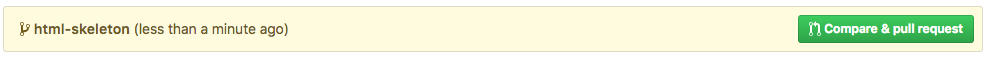
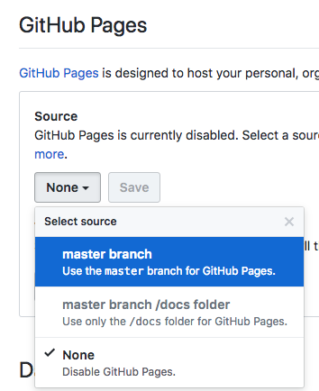

# GitHub Flow

Let's start the day following the **GitHub flow** from the very beginning until deployment. We will deploy a very simple HTML page to focus our learning on `git` and GitHub rather than Python code.

## Some reading

In 2011, Scott Chacon, one of the original founder of GitHub wrote a [blog article](http://scottchacon.com/2011/08/31/github-flow.html) where he first introduced the concept of Github flow. Historically, he wanted something simpler than another known methodology named [_git flow_](https://nvie.com/posts/a-successful-git-branching-model/) (that's not the same thing!).

GitHub put together a [nice little guide](https://guides.github.com/introduction/flow/) that you may want to read now.

## Getting Started

Before we actually do our first commit, we need to create a GitHub repository!

1. Log in to GitHub
1. Go to [github.com/new](https://github.com/new) and create a _public_ repository under your _personal_ account, name it `github-flow`.
1. Go to your terminal and create a new repository locall. Add GitHub as the `origin` remote:

```bash
# 💡 Be careful with this one! Don't blindly copy/paste!
mkdir -p ~/code/$YOUR_GITHUB_USERNAME/github-flow && cd $_

git init
touch README.md
touch index.html
git add .
git commit -m "Initialize repository"

# 💡 Be careful with this one! Don't blindly copy/paste!
git remote add origin git@github.com:$YOUR_USERNAME/github-flow.git

git push origin master
```

Go to [github.com](https://github.com) and refresh your repository page. You should see the commit and two files!

## Your first Pull Request

Let's start working on this repository. Before touching the code, we must create a **feature branch**. Our goal is here is to add a basic HTML skeleton to the project. We can do this:

```bash
git checkout -b html-skeleton
```

This commands _creates_ the branch and _switches_ to it. You can see the Git Bash prompt is updated and no longer displays `master`. You are ready to code in this branch!

```bash
subl .
```

Open the `index.html` file and write some HTML code.

<details><summary>Some inspiration</summary><p>

👉 Here is some [inspiration](https://gist.github.com/ssaunier/faa9965201153555bc954fb4713eea7c) if you need.

</p></details>

You can open this file in Chrome (go to File Explorer, browse to the right folder and then drag/drop or the `index.html` file into a Google Chrome window).

When you are happy with your code and with the way it look in the browse, it's time to commit!

```bash
git status # Which files were changed?
git diff index.html # What changes were done?

git add index.html
git commit -m "Add basic skeleton HTML"
```

Commit is now done locally. Time to push. What will be the command?

<details><summary>View solution</summary><p>

```bash
git push origin html-skeleton
```

</p></details>

Now head to your repository on GitHub and refresh the page. You should see this:



Click on the green button to create your first pull request.

### Reviewer

You now need someone to look at your code, give some feedback and eventually merge it (a rule when using the GitHub flow is that someone other than the author should merge a Pull Request).

Head over to `github.com/$YOUR_USERNAME/github-flow/settings/collaboration` (accessible through `Settings` > `Collaborators`) and add your seat neighbour to the repository by asking his/her github nickname. They should receive an email invitation to opt-in.

Once this setup is done, ask them to go to the Pull Request page (should be PR #1) and review the code. If they have some comments (indentation, error, etc.) and you need to do some fixes, go back to Sublime Text, in the same branch, update the code and do another commit. Push this commit to GitHub: you will see that the Pull Request automatically updates!

In the end, if you and your reviewer agree on the code, the reviewer should **merge** the Pull Request. After merging, there is a button "Delete branch". We advise that you click on it, because in the GitHub flow, a **merged branch is a dead branch** and no work should be pushed to it anymore.

### What happens next?

Merging the Pull Request on GitHub created a merge commit on `master`. It means that your local repository on your laptop is not up to date anymore.

Here is what you need to do:

```bash
# Go back to the branch
git checkout master

# Get your `master` branch up to date with GitHub's
git pull origin master

# The feature branch is dead. Remove it! Keep a clean repo
git branch -d html-skeleton
```

That's it! You are ready to work on the next feature branch Start over at the `git checkout -b <branch>` step.

## Practise makes perfect

Take some time to practise this flow. You can create the following feature branches:

- `add-basic-css-style`
- `add-background-image`
- ...

Remember, it's always the same flow:

```bash
# IMPORTANT: Start from a `master` with a **clean** `git status`.

git checkout -b $FEATURE_BRANCH

# Write some code

git status # Which files were changed?
git add <file1> <file2> ...
git commit -m "Quickly describe to your teammates what you did here"
git push origin $FEATURE_BRANCH

# Go to github.com - Open a Pull Request. Ask your buddy to review it

# Do some more commits on the branch with your buddy feedback

# Teammate is happy with the changes and **merge** it.

git status # ⚠️ Make sure there is no work pending before changing branches!
git checkout master
git pull origin master
git branch -d $FEATURE_BRANCH

# Start over!
```


## Bonus - GitHub Pages

If you have a simple **static** website to host, GitHub provides a great solution: [GitHub Pages](https://pages.github.com/). You can turn a repository into a host provider!

It is really simple to enable. On your `github-flow` repository, go to `Settings` > `Options` and scroll down until you reach the `GitHub Pages` section just before the `Danger Zone`.

Under the `Source`, click on the dropdown list and select the `master` branch. Then click `Save`



It will reload the page. If you scroll down you should see a sentence: Your site is ready to be published at:... And here your are! The URL of your website:

```bash
http://$GITHUB_NICKNAME.github.io/$REPO_NAME/
```

Every time a commit happens in `master` (through a merged Pull Request using the GitHub flow), GitHub Pages will automatically deploy the changes to this URL. With this set up, the `Merge` button under a Pull Request becomes a **Deploy** one.

If you own a domain, GitHub Pages also supports [`CNAME`](https://help.github.com/articles/using-a-custom-domain-with-github-pages/) configuration.

## Final thoughts

The power of the GitHub flow comes from being accessible even to `git` beginners. `git` is a very powerful tool and can be intimidating if not introduced correctly. With that flow, anyone in the team can pick up the collaboration process with a little training (what you just did!) and just needs to remember a few commands: `status` (and `diff`), `checkout -b`, `add`, `commit -m`, `push`, `checkout`, `pull`, `branch -d` and that's it.

If you talk with other developers about `git`, some advanced concepts might come up, like `stash`, `cherry-pick`, `rebase`, `reset` or `reflog`. There is plenty of time to learn about those topics (`stash` being in our opinion the easiest and most useful) and adapt your knowledge to your team. We won't cover these topics but at least you have some keywords to Google!

