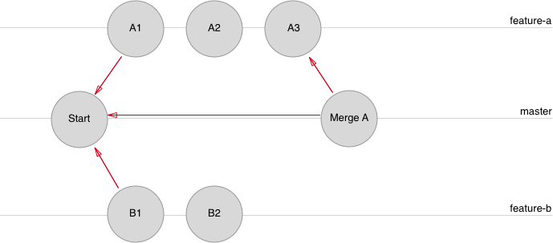
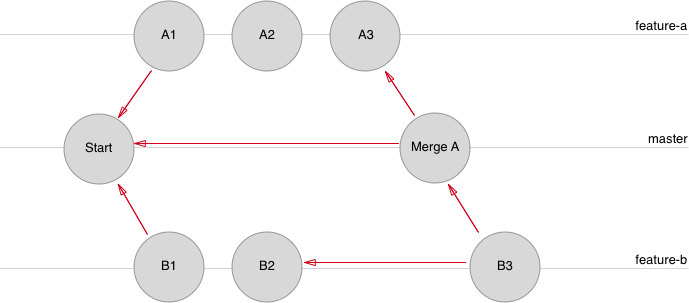
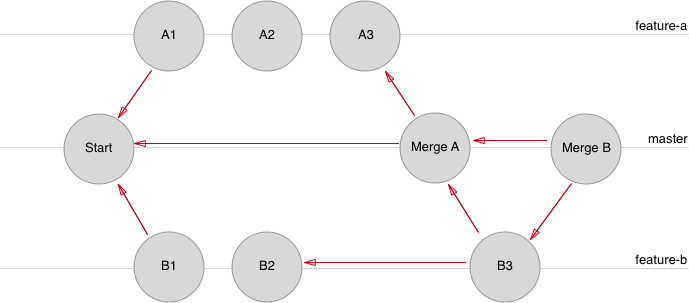

# Handling `git` conflicts

When using a source control software like `git`, conflicts **always** arise at some point. It's just a matter of time. Let's use this exercise to understand the scenarios which always lead to conflict. Knowing that will help prevent the conflicts! Of course, we will also cover how to deal with a conflict.

## GitHub flow most common conflict scenario

Imagine the following scenario:

1. 2 developers are working on the same git repository
1. On Monday, at 9am, the two developers `pull` master.
1. From the same commit (`HEAD`), they create a branch:
  1. Developer A creates the `feature-a` branch
  1. Developer B creates the `feature-b` branch
1. They spend the morning working on their own feature. They commit several times on their branches and push their work to GitHub to save it (in case of a computer crash, developers would be able to retrieve their WIP from the pushed branch on GitHub)
1. Developer A is done at 11am, Developer B is not. Developer A heads to GitHub to create a Pull Request for `feature-a`.
1. Developer C reviews the code at 11:05am and find it good enough (perfect?). Anyway, Developer C **merges** `feature-a` to `master` on the GitHub Pull Request interface.

❓ Let's pause for a minute. Can you draw a picture of the scenario `git`-wise? ✏️ Take a pencil and a sheet of paper.

<details><summary>View solution</summary><p>



</p></details>

<br>

❓ This exact situation may or may not provoke a conflict. Can you guess the condition when a conflict will arise?

<details><summary>View solution</summary><p>

Let's suppose that on Monday, 9am, the latest commit in `master` held the following content for `./index.html`:

```html
<!DOCTYPE html>
<html>
  <head>
    <style type="text/css">
      h1 {
        color: red;
      }
    </style>
  </head>
  <body>
    <h1>Hello world!</h1>
  </body>
</html>
```

💡 CSS should be in a separated file. We just try to keep this example simple.

Now suppose that in `feature-a`, Developer A changed line 6 of this file to put `color: green`. During the same time, Developer B changed the exect same line in `feature-b` to put `color: orange`.

As `feature-a` got merged, `master` now has `color: green` on line 6. That's a conflict that will arise as this line changed since `feature-b` was created **and** it was changed in a commit of `feature-b`. If those two conditions are met, **then** you will always have a conflict.

</p></details>

<br>

How do we solve this conflict then? First of all, we need to __reveal__ it, by updating the `feature-b` with the latest version of `master`. We can do so with the following command:

```bash
git status # Make sure that it's clean. Commit if not
git checkout master
git pull origin master

# As of now, our local `master` is synced with remote `master` from GitHub

git checkout feature-b
git merge master

# 💣 Boom! Conflict!
# Auto-merging index.html
# CONFLICT (content): Merge conflict in index.html
# Automatic merge failed; fix conflicts and then commit the result.
```

The merge did not go through, and now our git repository is in an unstable state. To solve the problem, we need to open every file with a conflict, and fix the code. A conflict would look like this in the `index.html` file:

```html
<!DOCTYPE html>
<html>
  <head>
    <style type="text/css">
      h1 {
<<<<<<< HEAD
        color: orange;
=======
        color: green;
>>>>>>> master
      }
    </style>
<!-- [...] -->
```

With this UI, it's clear that the conflict comes from the fact that `git` does not know how to merge those changes! Developer A wants "green", Developer B wants "orange"! `git` can't choose! It's time for both developers to have a discussion and decide what color to keep. See how `git` helps team collaboration?

Once the discussion happened, it's time to solve the conflict in Sublime Text:

```html
<!DOCTYPE html>
<html>
  <head>
    <style type="text/css">
      h1 {
        color: orange; /* Developers agreed on orange */
      }
    </style>
<!-- [...] -->
```

Back to the terminal, let's mark the conflicted file as solved:

```bash
git add index.html
git commit --no-edit # Preserve the original merge commit
```

The commit tree now looks like this:



The conflict is solved, Developer B can keep working in `feature-b` until the feature is finished. At that point he/she will `push` and open a Pull Request on GitHub.

❓ Once the second pull request is merged, how will the commit graph look?

<details><summary>View solution</summary><p>



</p></details>

<br>

### Your turn!

Find a buddy to replicate this scenario:

1. One of you creates the repository locally with the HTML skeleton described above. Don't reuse the `github-flow` repository but re-use the technique! You can name this new repo `git-conflict`.
1. The same developer goes to GitHub, create the repository and add the other as a collaborator
1. The same developer adds the **remote** and `push`es.
1. The other developer **clones** the repository.
1. `git log` should show only one commit on both laptop
1. You are ready to replicate the above scenario with the two feature branches! Remember to open two pull request. The first one will be merged easily, and the second one won't be mergeable because of the conflict.

Don't hesitate to ask a teacher if you are confused with a step.

## Going futher

Conflicts are not the only problem you will have using `git`. Sometimes you just want to discard local modifications, or undo a commit, even harder undo a commit _you already pushed_, etc. Take some time to read the following resources:

- [10 Common git problems](https://www.codementor.io/citizen428/git-tutorial-10-common-git-problems-and-how-to-fix-them-aajv0katd)
- [Oh, shit, git!](http://ohshitgit.com/)

Also, sometimes you have work in progress in a branch that you don't want to commit, but you need to change branches and can't do so if your `git status` is clean. The solution is to use [`git stash`](https://www.atlassian.com/git/tutorials/saving-changes/git-stash)!

Finally, `git` can also be used with advanced GUIs. Usually, developers tend to stick in the command line but sometimes, especially to **visualize diffs**, using a GUI can help a lot. You can download [GitHub Desktop](https://desktop.github.com/) and try it. The interface is very simple, browsing the history pleasant and re-reading a diff before a `commit` something worth considering the tool.
