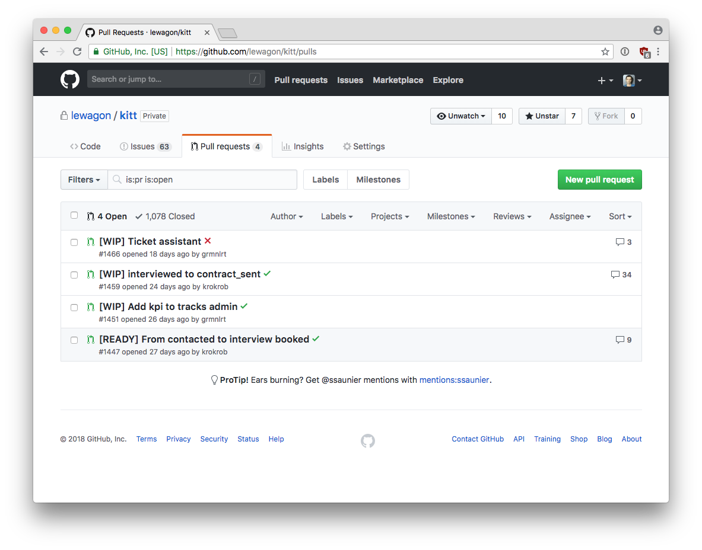
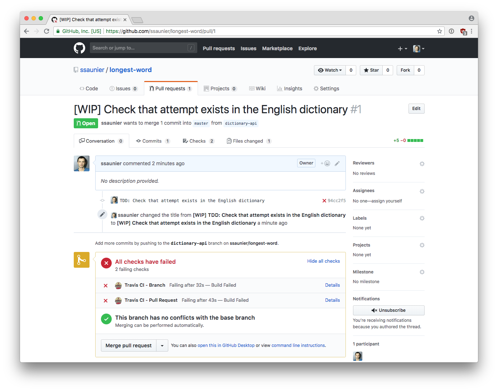
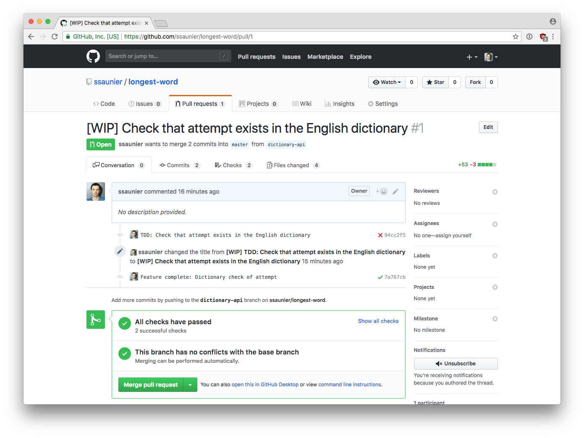

# Continuous Integration

Having tests on a repository gives you a tremendous advantage: you can set up [**Continuous Integration**](https://en.wikipedia.org/wiki/Continuous_integration). The _Best Practises_ section of this Wikipedia article is worth a read.

The goal of this exercise is to link our version control software with a build automation tool. The idea is that you want the build automation to run every time a commit reaches the version control, in any branch, a build is triggered to give feedback to the developers as soon as possible if this commit is _green_ or _red_ (meaning the tests are passing / the build can complete).

## Tools

As for version control software, there are many tools available to achieve Continuous Integration:

- [Jenkins](https://jenkins.io/), the most popular on-premise CI software (you need to install it)
- [Travis](https://travis-ci.com/), the most popular **cloud** CI service
- [Many others](https://en.wikipedia.org/wiki/Comparison_of_continuous_integration_software)

To keep this exercise simple, we will use Travis, as it integreates perfectly with GitHub (and you'll see that's important) without any configuration effort on the developer's side. Plus, it's **free** for public GitHub repositories!

## Service installation

We will deploy the repository you created in the previous exercise:

```bash
cd ~/code/$YOUR_GITHUB_USERNAME/longest-word

git init
git add .
git commit -m "Game development with TDD"
git push origin master
```

Head over to [github.com/marketplace/travis-ci](https://github.com/marketplace/travis-ci) and click on the green button "Set up a free trial". It will scroll down to a section where you can choose the `Open Source - $0` option. Then click on the "Install it for free" green button. Follow the guides.

Once this configuration step, you can go to `github.com/$YOUR_GITHUB_USERNAME/longest-word/settings/installations` and see that **Travis CI** has been installed into your repository. Neat!

## Configuration

You now need to write a CI configuration script. Those tool are _generic_, they can build programs in many language, with many frameworks. We need to be specific and explain to Travis that our project is a Python 3 one, that we use `pipenv` to handle external dependencies and that we use `nosetests` to run tests.

In order to do that, Travis reads the `./.travis.yml` file at the root of your repo:

```bash
touch .travis.yml
subl .travis.yml
```

```yml
# .travis.yml

language: python
python: 3.7
dist: xenial
install:
  - pip install pipenv
  - pipenv install --dev
script:
  - pipenv run nosetests
```

Save this file in Sublime Text, and perform a commit:

```bash
git add .travis.yml
git commit -m "Configure Travis to run nosetests"
```

Awesome! Before we actually push, go to this page:

```
github.com/$YOUR_GITHUB_USERNAME/longest-word/commits/master
```

You should have one commit. Now go back to the terminal:

```bash
git push origin master
```

When the push is done, go back to the page, and **reload** it. You should see the commit get a yellow circle, and then a green tick! This is the integration between GitHub and Travis CI. It will run everytime you push commits to GitHub, thanks to [GitHub webhooks](https://developer.github.com/webhooks/) and the [Travis API](https://docs.travis-ci.com/user/developer/#API-V3) integration.

## Continuous Integration & Pull Request

Let's enhance our Game with a refined validation. Right now, you can win with the following scenario:

```
Grid: KWIENFUQW
My proposition: FEUN
```

```python
new_game = Game()
new_game.grid = list('KWIENFUQW')
new_game.is_valid('FEUN')
# => true
```

Sure, it is syntatically valid (each letter of `FEUN` can be found in the grid), but this is not a valid English word from the dictionary!

Let's work on that in a new feature branch:

```bash
git checkout -b dictionary-api
```

Following the TDD paradigm, we need to add a test:

```python
# tests/test_game.py
# [...]
    def test_unknown_word_is_invalid(self):
      new_game = Game()
      new_game.grid = list('KWIENFUQW') # Force the grid to a test case:
      self.assertIs(new_game.is_valid('FEUN'), False)
```

Let's commit this right now:

```bash
git add tests
git commit -m "TDD: Check that attempt exists in the English dictionary"
git push origin dictionary-api
```

Now let's open a Pull Request on GitHub for this branch. You might find it a bit early but that's something which is actually encouraged by the [GitHub flow](http://scottchacon.com/2011/08/31/github-flow.html):

If you are stuck in the progress of your feature or branch and need help or advice, or if you are a developer and need a designer to review your work (or vice versa), or even if you have little or no code but some screenshot comps or general ideas, you open a pull request.

At Le Wagon, developers open Pull Request early on for their feature branches to show teammates what they are doing and sollicitate feedback early. No need to wait to be code-complete to open the Pull Request! Here is a screenshot of our main application, using the `[WIP]` prefix in the pull request titles to showcase the fact that the branch is not ready yet to be merged:



Back to our Pull Request. If you scroll a bit below the PR description and the list of commits, you will see the Travis CI integration shine:



The benefit is really important. You have a direct feedback, right in GitHub, about the build status of your branch. Of course here we actually _want_ to have a red branch as we added a test but did not implement the behavior yet. Still, you can imagine that someone pushing some code and forgetting to run the tests locally on their machine will be warned directly on GitHub that they broke the build.

---

Let's go back to the implementation of our feature. We want to pass the following test:

```python
pipenv run nosetests tests/test_game.py:TestGame.test_unknown_word_is_invalid
# See how we just run *one* test and not the whole suite?
```

❓ Here are some tips to implement this feature:

- You can use Le Wagon's homemade simple [Dictionary API](https://wagon-dictionary.herokuapp.com/)
- You can `pipenv install requests` to make [HTTP requests](http://docs.python-requests.org/en/master/) to this API.

<details><summary>View solution</summary><p>

We can implement a private `__check_dictionary` method to run an API call.

```python
# game.rb
# [...]
import requests

class Game:
    # [...]

    def is_valid(self, word):
        # [...]

        return self.__check_dictionary(word)

    def __check_dictionary(self, word):
        r = requests.get(f"https://wagon-dictionary.herokuapp.com/{word}")
        response = r.json()
        return response['found']
```

</p></details>

<br>

Don't forget to run the tests locally until you have 5 passing tests. When you are done, time to observe the effect on GitHub / Travis CI!

```bash
git add .
git commit -m "Feature complete: Dictionary check of attempt"
git push origin dictionary-api
```

Go back to your Pull Request page, you should see the icons turning from red crosses to yellow dots. It means that Travis CI is building the code against the latest commit. Wait a few seconds, and it should update the status. This is what you should see:



Awesome job 🎉! Invite your buddy as a repo collaborator to review the code in the Pull Request and **merge** it.

## Conclusion

Adding tests to a repository and coupling GitHub with a service like Travis CI gives the developer peace of mind when adding code, checking for possible regressions, exercising the whole test suite for _every single_ commit!

Before pushing DevOps farther with the next exercise about Continuous Deployment, some final advices:

- Keep Pull Request diffs as short as possible. A good size is **less than 100 lines** in the diff (`Files changed` tab on the Pull Request)
- Keep Pull Request focused on a _single_ feature. Add at least a test for each pull request
- Before asking for a review, re-read your code in the `Files changed` tab. Seeing the code from this perspective (in a web browser under a diff format) will help you spot style issues, refactoring opportunities, etc. that you could not see directly in your text editor.
- Finally, your friends at GitHub wrote a great piece on [how to properly write](https://blog.github.com/2015-01-21-how-to-write-the-perfect-pull-request/) in a Pull Request (both for the reviewee and the reviewer).
