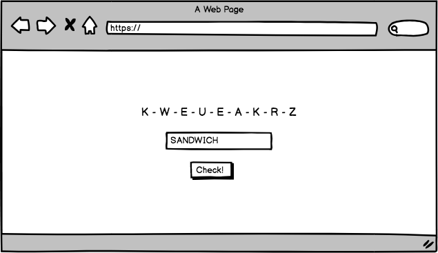

# Continuous Deployment

The DevOps graal that teams want to achieve is **Continuous Deployment**. The idea is to configure your hosting environment in such a way that every change in `master` which yields a green build on the Build Automation tool _can_ and _will_ be pushed to production as soon as possible.

In this exercise, we will set up a [**PaaS**](https://en.wikipedia.org/wiki/Platform_as_a_service) to host our longest word game.

## HTTP server

Before pushing our code to a hosting provider, we would like to be able to interact with it. The easiest way to do this is to encapsulate the game around a small HTTP server.

We will build a simple page which will display the random grid. Underneath this grid, a form with an input to type a word, and a submit button.

When clicking the button, the form will be submitted and will reload the page to showcase the results.



Go back to your code, and create a branch to start working on this feature.

```bash
cd ~/code/$YOUR_GITHUB_USERNAME/longest-word

git status # is that clean?
git checkout master
git pull origin master
git branch -d dictionary-api
git checkout -b http-server
```

We are going to use [Flask](http://flask.pocoo.org/), a microframework to quickly build web apps.

```bash
pipenv install flask
touch wsgi.py
subl .
```

Open the `wsgi.py` file and copy paste the following code:

```python
# wsgi.py
from flask import Flask
app = Flask(__name__)

@app.route('/')
def home():
    return "Hello world!"
```

You can start this very basic Flask app with:

```bash
FLASK_ENV=development pipenv run flask run
```

Open your browser and go to [localhost:5000](http://localhost:5000/). Is it working, do you get "Hello World" as a text response from the server? If not, call a teacher.

This exercise goal is not about implementing the little application, we will cover Flask in details in tomorrow's lecture. So let's build together our application:

```bash
mkdir static
touch static/style.css
mkdir templates
touch templates/home.html
```

We just created a CSS stylesheet and the HTML template for the Home page. Let's add the business logic in `wsgi.py`:

```python
# wsgi.py
from flask import Flask, render_template
from game import Game

app = Flask(__name__)

@app.route('/')
def home():
    game = Game()
    return render_template('home.html', grid=game.grid)
```

In the code above, we are initializing a new `Game` instance to generate a grid. We pass this grid as a local variable to the `home.html` template, so that we can use it in the view.

```html
<!-- templates/home.html -->
<!DOCTYPE html>
<html>
  <head>
    <meta charset="utf8" />
    <title>Longest Word</title>
    <link rel="stylesheet" href="{{ url_for('static', filename='style.css') }}">
  </head>
  <body>
    <h1>Longest Word</h1>
    <div>
      
        <span class="letter">{{ letter }}</span>
      
    </div>
    <form action="/check" id="form" method="post">
      <input type="hidden" name="grid" value="{{ ''.join(grid) }}">
      <input type="text" name="word">
      <button>Check!</button>
    </form>
  </body>
</html>
```

We give you also some CSS:

```css
/* static/style.css */
body {
  font-family: sans-serif;
  display: flex;
  align-items: center;
  justify-content: center;
  flex-direction: column;
}
.letter {
  border: 1px solid #999;
  padding: 8px 6px;
  width: 24px;
  display: inline-block;
  text-align: center;
  background-color: #333;
  color: #eee;
}
#form, #results {
  margin: 1em 0;
}
.valid {
  color: green;
}
.invalid {
  color: red;
}
```

Phew! Now let's try this, head over to your browser and reload the page. Can you see the grid with a form? Awesome!

If you try to play, you will get an error. It's because we have not implemented the `/check` endpoint yet (the one where the form gets submitted to).

```python
# wsgi.py
from flask import Flask, render_template, request

# [...]

@app.route('/check', methods=["POST"])
def check():
    game = Game()
    game.grid = list(request.form['grid'])
    word = request.form['word']
    is_valid = game.is_valid(word)
    return render_template('check.html', is_valid=is_valid, grid=game.grid, word=word)
```

The idea is that we get the grid (as a hidden field) and the word (the one you typed in the input) from the previous request, then we build a `Game` instance and check if the word is valid. We feed this information back to the `check.html` view to be used to display the results.

💡 We need to actually pass the grid in the `POST` request as HTTP is **stateless**.

```html
<!-- templates/check.html -->
<!DOCTYPE html>
<html>
  <head>
    <meta charset="utf8" />
    <title>Longest Word</title>
    <link rel="stylesheet" href="{{ url_for('static', filename='style.css') }}">
  </head>
  <body>
    <h1>Longest Word</h1>
    <h2>Result</h2>
    <div>
      
        <span class="letter">{{ letter }}</span>
      
    </div>
    <div id="results">
      Your word: <strong>{{ word }}</strong>.
      
        <span class="valid">Congrats, it's valid!</span>
      
        <span class="invalid">Sorry, it's invalid...</span>
      
    </div>
    <div>
      <a href="/">New game</a>
    </div>
  </body>
</html>
```

That's it! Your app should be working correctly. Time to commit, push and _open a Pull Request_ on GitHub:

```bash
git add .
git commit -m "Small web app wrapper around the Game"
git push origin http-server
# head to github.com to open a Pull Request!
```

## Heroku Setup

Before we can deploy our neat little web application, we need to set up a Heroku account. If you already have one, great, you can use this one. Otherwise, [sign up](https://signup.heroku.com/) (it's free to try). Put an email address that you can easily access as you will need to click on a confirmation link.

Once your account is created, you need to install the command line tool. Go to [this Heroku Dev Center page](https://devcenter.heroku.com/articles/getting-started-with-python#set-up), download the CLI and install it. Do not leave the `Git` option tick in the components to install as you already have it! Leave `Heroku CLI` and `Set PATH...` ticked.

Open Git Bash and log in:

```bash
heroku update
heroku login
```

If there is an issue, you may [need to use `winpty`](https://github.com/heroku/cli/issues/84)

We can now prepare our app to run on Heroku. There is just one little missing piece: we need to tell Heroku how to **start** our application. To do so, we need to create a special file:

```bash
git status # is it clean?
git checkout master
git pull origin master

# Let's work on `master` for this specific case, not in a branch.
touch Procfile
```

And put the following in this `Procfile`:

```bash
# Procfile
web: gunicorn wsgi:app
```

We can't use the regular `flask run` command in production, we must use [`gunicorn`](https://devcenter.heroku.com/articles/python-gunicorn) which stills need to be added to the `Pipfile`:

```bash
pipenv install gunicorn
git add .
git commit -m "Add Procfile to prepare Heroku deployment"
git push origin master
```

Our app is now ready to be deployed to Heroku. First we need to create a remote application which will provision a [dyno](https://www.heroku.com/dynos) in their cloud.

```bash
heroku create --region=eu # We want to use the EU datacenter to be closer to us
git remote -v
# See? There's not only `origin` as a remote now!
git push heroku master # That's the actual deployment command!

# Once our application is deploy, we can open it in Chrome with:
heroku open
```

All good? If not, you can debug production with `heroku logs --tail` and of course ask a TA.

## Continuous Deployment

We are almost there. A quick recap gives us:

1. Our code is on GitHub
1. We have Continuous Integration set up thanks to Travis
1. Every commit (in `master` or a feature branch) triggers a Travis build
1. A Pull Request status is updated by Travis and gives context to reviewer
1. We still need to **manually** run the `git push heroku master` command to deploy

Let's automated this last part and reach the graal!

Head over to [dashboard.heroku.com](https://dashboard.heroku.com). Click on your application hosting the `longest-word`.

 Go to the `Deploy` tab (the third one). If you scroll down, you would see a `Deployment method` section. Click on `GitHub`. Scroll down and click on the `Connect to GitHub` purple button.

 You will then be able to select the `longest-word` repository and **connect** it to this Heroku app.

 After this step, if you scroll down a bit again, you will find the `Automatic deploys` section. That's where you'll be able to tick the `Wait for CI to pass before deploy`, select `master` (default) in the dropdown, and click on the **Enable Automatic Deploys** black button.

 That's it! But is it really working?

 ---

 Let's test it!

 Let's do a very simple change. We will update the background-color of grid letters.

```bash
git checkout -b yellow-letter
```

```css
/* static/style.css */
/* [...] */
.letter {
  /* [...] */
  background-color: #FFEB3B;
  color: #666;
}
```

You can test it locally with `FLASK_ENV=development pipenv run flask run`. If the CSS change are not picked up, do a [force-refresh](https://superuser.com/a/89811).

Happy with the color? Let's commit:

```bash
git add static/style.css
git commit -m "Change letter grid background-color to yellow"
git push origin yellow-letter
```

Go to github.com, create a Pull Request and wait for Travis to turn it green.

While Travis is working, open another Chrome tab and go the `Activity` tab (the 5th one) of your Heroku application to visualize your acitivty feed. Leave this tab open.

Come back to the Pull Request, and as soon as it is green, merge it to `master`. Go back to the Heroku tab, and wait ~1 minute (in GitHub you can have a look at the `Commits` page and see that the latest merge commit is being tested by Travis, thanks to the little orange dot).

Did you get it? Did you get an automated build/deployment on Heroku thanks to a green light from Travis to a new merge commit on `master` on GitHub?

👏 👏 👏

## Going further

This kind of development with small feature branches which are automatically deployed to production as soon as they are merged to master might not work for big feature which need several steps, several pull request, etc. You don't want to keep a feature branch open for weeks as the Pull Request would be basically horrible to review, and merging it back to `master` would be a nightmare. We still encourage small pull requests, but hide the feature being developed behind a [**feature toggle**](https://en.wikipedia.org/wiki/Feature_toggle).

## (Optional) Score & Session

If you are done with all the exercises of the day, go back to the optional sudoku from yesterday if you did not finish it (or exercises before).

If this is done as well, have a look at the [Flask documentation](http://flask.pocoo.org/). We will cover Flask in tomorrow's lecture, in the meantime, you can try to implement a feature in the Longest Word Game: a global **score**! The idea is that every time a user finds a valid word, you increments points (1 point per letter). As HTTP is stateless, you need to use [this Flask extension](https://pythonhosted.org/Flask-Session/) to handle the concept of **session** (with `SESSION_TYPE='filesystem'`).
