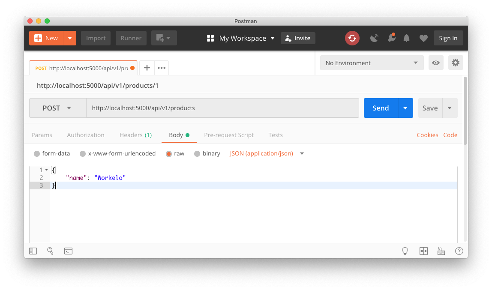

# Flask CRUD


[Flask](http://flask.pocoo.org/) is a **microframework** for Python to quickly build a web application.

In this exercise, we will quickly go over every important features of Flask.

## Getting started

You will work in a dedicated repository to apply the best practices covered in the previous lecture.

```bash
cd ~/code/<your_username>
mkdir flask-101 & cd $_
pipenv --python 3.7
pipenv install flask gunicorn
touch wsgi.py
subl . # Open Sublime Text in the current folder.
```

Curious what packages Flask is relying on? Run this in your terminal:

```bash
pipenv graph
```

Neat, isn't it?

### Flask Boilerplate

In your `wsgi.py` file, copy paste the following boilerplate:

```python
# wsgi.py
from flask import Flask
app = Flask(__name__)

@app.route('/')
def hello():
    return "Hello World!"
```

What does this code do?

1. First we imported the Flask class. An instance of this class will be our Web application.
1. Next we create an instance of this class. The first argument is the name of the application’s module or package.
1. We then use the `route()` decorator to tell Flask what URL should trigger our function.
1. The function is given a name which is also used to generate URLs for that particular function, and returns the message we want to display in the user’s browser.

### Development run

Go back to your terminal and run:

```bash
FLASK_ENV=development pipenv run flask run
```

The server should start. Open your browser and visit [`localhost:5000`](http://localhost:5000). You should see "Hello world!" as a text answer!

Try to edit the code and reload the page in the browser. 💡 What is happenning?

### Production run

In production, we don't want to use the default Flask server, optimized for development, but something like [Gunicorn](http://gunicorn.org/), already installed in the `Pipfile` thanks to a previous command.

The production server will run this code:

```bash
# Ctrl-C to kill the previous server
pipenv run gunicorn wsgi:app --access-logfile=-
```

:bulb: If you launch this on Windows, it will fail as gunicorn does not support (yet?) Windows:

- https://github.com/benoitc/gunicorn/issues/524
- https://stackoverflow.com/questions/11087682/does-gunicorn-run-on-windows (they talk about [`waitress`](https://docs.pylonsproject.org/projects/waitress))

## Heroku

Let's try to deploy this application to Heroku:

```bash
touch Procfile
```

```bash
# Procfile
web: gunicorn wsgi:app --access-logfile=-
```

```bash
git init
git add .
git commit -m "First deployment of Flask boilerplate"

heroku create --region=eu
git push heroku master

heroku ps                  # Do you have a free dyno up running `gunicorn`?

heroku open                # Do you get an "Hello world" in the browser?
heroku logs -n 1000 --tail # Check the access logs are coming up. Reload the browser.
```

## JSON

Right now, our app returns some plain text. Today's goal is to build a REST API.

👉 Add a `/api/v1/products` route which will return a JSON array out of the plain list of dict:

```python
PRODUCTS = [
    { 'id': 1, 'name': 'Skello' },
    { 'id': 2, 'name': 'Socialive.tv' }
]
```

:bulb: **Tip**: Have a look at [`jsonify`](http://flask.pocoo.org/docs/api/#flask.json.jsonify)

To test your code, open the browser and go to [`localhost:5000/api/v1/products`](http://localhost:5000/api/v1/products).

:bulb: **Tip**: Install the [JSONView Chrome extension](https://chrome.google.com/webstore/detail/jsonview/chklaanhfefbnpoihckbnefhakgolnmc) to have a better visualisation of JSON HTTP responses.

Commit and push your code to Heroku. Check the new `/api/v1/products` endpoint works in **production**.

## Testing

Testing our APIs will be mandatory. Whether we use strict TDD or not during the development process, at some point the application should have tests exercising every endpoint.

We are using an external module called [`Flask Testing`](https://pythonhosted.org/Flask-Testing/).


```bash
pipenv install flask-testing nose --dev
```

Now let's create the `tests` directory and a first test file. This test file is about **views**, which is the closest component to the HTTP response in a MVC framework (more on that later):

```bash
mkdir tests
touch tests/test_views.py
```

Open the file in Sublime Text, read and copy-paste this.

```python
# tests/test_views.py
from flask_testing import TestCase
from wsgi import app

class TestViews(TestCase):
    def create_app(self):
        app.config['TESTING'] = True
        return app

    def test_products_json(self):
        response = self.client.get("/api/v1/products")
        products = response.json
        self.assertIsInstance(products, list)
        self.assertGreater(len(products), 2) # 2 is not a mistake here.
```

Then open the terminal and run:

```bash
pipenv run nosetests -s
```

👉 Your test should be failing. How do you fix the code in `wsgi.py` to make the test green?

(`-s` flag is useful to actually view your `print()` statements, or use `pdb`).

<details><summary>View solution</summary><p>

Just add a third element to the `PRODUCTS` array!

</p>
</details>

## CRUD

Congratulations :tada: ! You wrote the first route of the RESTful API. Now it's time to implement the four other endpoints to properly implement CRUD on the `product` resource.

Practise the [GitHub Flow](../../02-Best-Practices/01-Github-Flow) with four feature branches (one per `CRUD` acronym letter), and push to `heroku` after each Pull Request merge!

### Read

First add a test for the `GET /api/v1/products/:id` route. Then implement it. This route retrieves a single `product` and serve a JSON representation of it (Status code: `200`). If the `:id` does not match any know product id then return a [`404`](https://developer.mozilla.org/en-US/docs/Web/HTTP/Status/404) (add a separate test case for this).

:bulb: **Tip**: Have a look at the [Variable Rules](http://flask.pocoo.org/docs/1.0/quickstart/#variable-rules) in the Flask documentation.

### Delete

Add a test for the `DELETE /api/v1/products/:id` route. This route will **remove** a single `product` from the fake `PRODUCTS` database. Return an empty response with status code [`204`](https://developer.mozilla.org/en-US/docs/Web/HTTP/Status/204).

:bulb: **Tip**: Have a look at how Flask defines an [HTTP Method](http://flask.pocoo.org/docs/quickstart/#http-methods) for a given route.

:bulb: **Tip**: If you want to TDD this method you will have a hard time as the Database is simulated in a constant list. Go ahead and only write the code in wsgi.py, we will cover later how to isolate the test environment and use a proper Database setup for that. This remark will be the same for the next two sections "Create" & "Update".

### Create

Start by adding a test for the `POST /api/v1/products` route. This route will **create** a new product in the fake `PRODUCTS` database and return the JSON representation of the newly created resource (Status code: [`201`](https://developer.mozilla.org/en-US/docs/Web/HTTP/Status/201))

:bulb: **Tip** You may need to use the [`Request.get_json`](http://flask.pocoo.org/docs/1.0/api/#flask.Request.get_json) method.

```python
from flask import request

request.get_json()
```

:bulb: **Tip** You might need to introduce a a way to generate auto-incremented ids:

```python
class Counter:
    def __init__(self):
        self.id = 3

    def next(self):
        self.id += 1
        return self.id

ID = Counter()
print(ID.next())
```

:bulb: **Tip** Here is a payload you can use in Postman to test this route:

```
{
    "name": "Workelo"
}
```



### Update

Finally, add a test for the `PATCH /api/v1/products/:id` route which will **update** an existing product (based on its id). Return a `204` when completed, or `422` if there is a validation error (needs a separate test case, validation error could be that supplied product name is _empty_)

